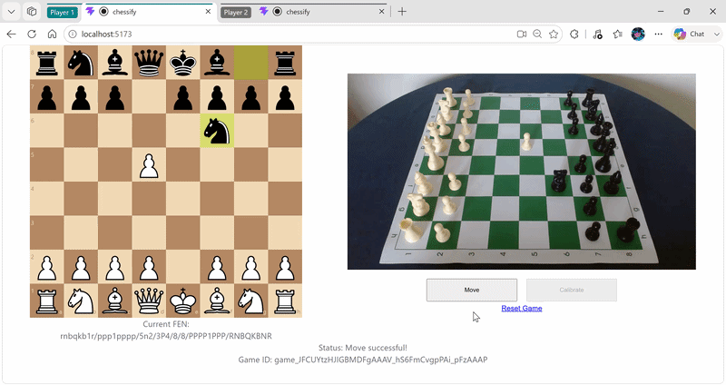

# chessify
Welcome to the chessify repository. chessify was developed as the final artefact for a dissertation; it is designed to enable over-the-board chess against a chess engine or a remote human opponent using only a webcam.



<details open>
  <summary>Table of Contents</summary>
  <ol>
    <li>
      <a href="#getting-started">Getting Started</a>
      <ul>
        <li><a href="#prerequisites">Prerequisites</a></li>
        <li><a href="#installation">Installation</a></li>
      </ul>
    </li>
    <li><a href="#usage">Usage</a></li>
    <li><a href="#license">License</a></li>
  </ol>
</details>

## Getting started

### Prerequisites
Before installing the dependencies, ensure your system meets the following requirements:
* **Python:** Version >= `3.13`
  ```sh
  # Windows (via winget)
  winget install Python.Python.3.13

  # macOS (via Homebrew)
  brew install python@3.13

  # Linux (Ubuntu/Debian)
  sudo add-apt-repository ppa:deadsnakes/ppa -y && sudo apt update
  sudo apt install -y python3.13 python3.13-venv
  ```
  
* **npm**
  ```sh
  # Windows (via winget)
  winget install OpenJS.NodeJS

  # macOS (via Homebrew)
  brew install node

  # Linux (Ubuntu/Debian)
  curl -fsSL https://deb.nodesource.com/setup_22.x | sudo -E bash -
  sudo apt-get install -y nodejs

  ## Then:
  npm install npm@latest -g
  ```

### Installation
1. Clone the repository.
   ```sh
   git clone https://github.com/b1leygr/chessify
   ```
2. Create a virtual environment.
    ```sh
    cd chessify
    python -m venv .venv
    ```
3. Activate the environment.
    ```sh
    # Windows (Command Prompt):
    .venv\Scripts\activate

    # Windows (Git Bash):
    source .venv/Scripts/activate

    # macOS/Linux:
    source .venv/bin/activate
    ```
4. Install dependencies.
    ```sh
    pip install -r requirements.txt
    cd app/frontend
    npm install

## Usage
### main.py
Processes board images stored in /notebooks and derives FEN strings.
1. Run main.py (from project root directory).
    ```sh
    python run main.py
    ```

### chessify
Allows a user to play a game against a chess engine or a human opponent (via ngrok).
1. Start the frontend development server (from <i>/app/frontend</i>).
    ```sh
    npm run dev
    ```
2. Start the backend API server (from <i>/app/frontend</i>, in a new terminal).
    ```sh
    npm run api
    ```
3. Access the application at http://localhost:5173 OR

4. Playing against a human opponent (requires ngrok).
    ```sh
    ngrok http 5173
    ````
    Access the applicaition at the public forwarding URL generated in the terminal and send it to your opponent.

## License
This project is licensed under the [GNU General Public License v3.0](LICENSE).